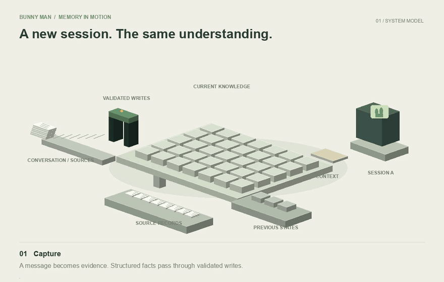

[](docs/assets/memory.mp4)

[Watch the full-resolution video](docs/assets/memory.mp4) · A conceptual model of the implemented memory paths. Green connections represent relationships; gold marks inferred knowledge. Evidence and superseded states remain underneath the live map.

# Bunny Man

I’m building a personal assistant that keeps learning how to help me across conversations, devices, and model changes. I can tell it something on my phone, pick up on my Mac, or switch between Claude and ChatGPT. The shared memory carries forward what it knows, what changed, and what still needs doing.

The core is a temporal knowledge map in Postgres: people, projects, preferences, commitments, and their relationships. Facts point back to evidence. Changes preserve the previous state. Nightly review can propose new connections and ask about inconsistencies; when supporting evidence changes, dependent inferences are invalidated. A correction can distinguish “this changed” from “this was never true.”

That memory powers the rest of the assistant:

- **A conversation that survives the session.** Shared history, bounded context, incremental updates, and deeper retrieval let new model instances pick up the same work.
- **Personalization learned in use.** Morning briefings, preferences, and standing rules develop through conversation rather than a hardcoded routine.
- **Follow-through between conversations.** Contextual reminders, email monitoring, calendar access, and background research bring useful information back into the same chat.
- **Code controls when; the model judges relevance.** Schedules, change checks, validated writes, and delivery records constrain background activity. The model applies my preferences inside those boundaries.
- **An assistant I can extend.** Separate model adapters, connected services, and owner-only tools for tested repository changes keep the system adaptable.

## How the memory works

The map stores entities, aliases, attributes, relationships, standing rules, plans, outcomes, and reminders. Conversations remain available as evidence and context, but the structured map determines the state the assistant reads.

- **Two clocks.** Facts record when they were true and when the system learned them. A late correction can change the current answer without erasing the previous understanding.
- **Explicit transitions.** Something that stopped being true is closed into history. Something that was never true is deprecated. Those are different operations, and both keep the source and reason.
- **Evidence-linked inference.** Nightly review can derive relationships and surface inconsistencies. Inferences reference their supporting facts. Database triggers invalidate dependent inferences when that support changes.
- **Authoritative correction.** A user clarification updates the affected knowledge and closes its question in one transaction. The nightly model cannot silently overwrite a stated fact.
- **Database-enforced writes.** Typed registries, foreign keys, interval constraints, locks, and immutable revisions handle the parts that need to be deterministic. A model proposes meaning; SQL controls how it becomes state.

Every user message queues a durable extraction job. A smaller model processes it asynchronously, so saving memory doesn't hold up a conversation. Explicit preferences and corrections can be written during the turn. Both paths use the same validated operations.

## Keeping a conversation continuous

Each session starts with a bounded snapshot of current knowledge and recent messages. The engine caches that context, sends changed sections as memory updates, and exposes search, entity views, and history tools for deeper retrieval. It doesn't paste the entire database into every prompt.

The hosted runtime stays warm between turns. The phone sends durable requests through an authenticated Supabase relay and replays persisted response events after reconnecting. Claude and Codex sit behind separate adapters, so the memory, tools, and conversation aren't tied to one provider.

## What I use it for

Typed and interruptible voice conversations, a morning review that learns my preferences, calendar planning, contextual reminders, email triage, and importing large blocks of existing context. A background reviewer looks across the map for emerging needs. Alerts carry evidence, are deduplicated and paced, and can be opened directly into a conversation about that notification.

I can also hand off research or a code investigation while keeping the conversation going. A bounded background worker messages me its result in the same chat. My owner instance can publish code changes as pull requests. Merging requires passing checks on the exact revision, and database migrations have a separate, scoped apply step. Other users do not get those development tools.

The phone streams Pocket TTS from the host. The Mac has local speech. Google Calendar remains authoritative for calendar events; reminders track commitments and completion separately.

## Stack and verification

SwiftUI on iOS and macOS, Python for the engine, Supabase/Postgres for memory and the relay, and a Railway worker defined in code. Model inference uses my existing subscriptions; this is currently a personal, single-owner deployment.

The test suite covers temporal updates, concurrent writes, inference invalidation, clarification transactions, notification deduplication, reconnect behavior, and streamed replies. Xcode tests replay audio and verify microphone mute and voice previews without requiring repeated manual phone tests.

```sh
scripts/test.sh
```

This creates a throwaway database, applies the migrations, and runs the SQL, Python, and shared Swift checks. It does not reset the app's persistent test memory.

## Running and exploring it

- [Knowledge map](docs/knowledge-map.md): the schema and update semantics.
- [Engine](docs/engine.md): sessions, context, tools, and runtime adapters.
- [Cloud deployment](docs/cloud.md): authentication, infrastructure, notifications, and the hosted worker.
- [Client contract](docs/client-contract.md): phone/host communication.
- [Connections](docs/connections.md): service integrations and setup.

```sh
pip3 install -r requirements.txt
export ASSISTANT_DATABASE_URL='postgresql://...'
python3 assistant.py talk

# Build the Mac app
scripts/build-mac.sh
open 'build/Bunny Man.app'
```

Open `ios/Assistant.xcodeproj` for the phone app. The assistant's name is centralized in `identity.json`. Development and deployment track `main`.

The next work is improving retrieval beyond the initial snapshot and making voice consistently comfortable. Memory search is currently lexical, inference still needs review, and this isn't yet a multi-user product. A standalone morning device is planned.
