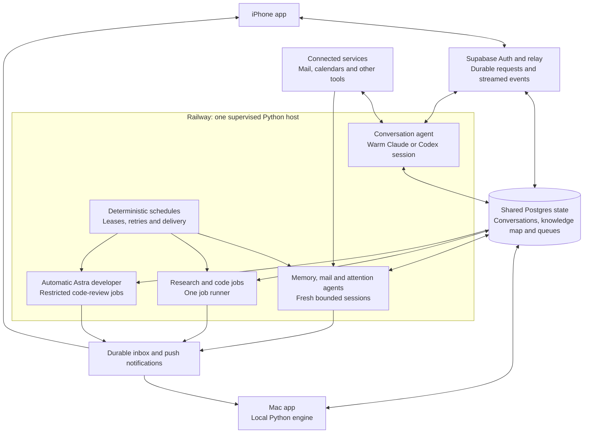

# The engine

Bunny Man is one shared assistant with several agent roles. A single Railway worker
runs the conversation and supervised background loops. Supabase holds the durable
state. Model sessions can end; conversations, knowledge, preferences and unfinished
work survive them.

## Runtime architecture



The boxes are responsibilities, not separate virtual machines. Provider harnesses
and speech can run as child processes, but the host owns scheduling and database
connections. Background jobs have no tools for recursively spawning more agents.
The phone uses the hosted engine; the Mac also supports running the engine locally
against the same map. The Pi interface is planned.

## Agent roles

| Role | Starts when | Reads and produces |
|---|---|---|
| Conversation | App request; kept warm between turns | Bounded current context, recent chat and deeper retrieval. Replies, validated memory updates and connected-service actions. |
| Morning | Explicit morning start | The conversation agent with morning instructions and persisted routine progress. Preferences come from memory; interruptions do not reset the agenda. |
| Memory extraction | A durable message job is pending | Source message, candidate facts, registries and retrieval tools. One atomic batch of structured updates and an extraction receipt. |
| Mail triage | The two-minute Gmail scan finds unprocessed messages | Incoming and sent mail, standing preferences and matching facts. Relevant memory jobs and eligible incoming-email alerts. |
| Nightly maintenance | After 03:00 local time, once per day when idle | Current map plus deeper retrieval. Evidence-linked inferences, duplicate-rule cleanup and clarification questions. |
| Proactive attention | Memory/work/day changes, subject to a 30-minute cooldown | Bounded current evidence and prior alerts. A useful nudge or queued research; reminder timing belongs to the scheduler. |
| Research / code worker | A durable job is queued | Scoped tools, task and saved checkpoints. Research results or durable source edits. Submitted code continues through deterministic delivery checks; verified outcomes reach the inbox. |
| Automatic developer | New chat evidence passes review eligibility | Astra inspects software defects and current source. A restricted PR or a review note; no automatic merge. |

Memory, mail, nightly and attention use the configurable background runtime factory.
Its Codex default is `gpt-5.5` with low effort; the Claude default is `haiku`.
`ASSISTANT_MEMORY_OPENAI_MODEL` and `ASSISTANT_MEMORY_CLAUDE_MODEL` override them.
Research/code jobs use their recorded provider and model. Automatic development
jobs explicitly select `gpt-6-astra` with high effort. These are separate model
sessions sharing durable state, not copies of one unlimited context window.

Reminders, email-send execution, queue dispatch and push delivery are code, not
additional agents. A model cannot approve its own email draft: the app confirms
the exact reviewed version before the sender worker can send it.

## Conversation and memory

`engine/engine.py` coordinates a session. The model's local session ID is a resumable
cache; the database message stream is the canonical history. Fresh sessions receive
a bounded snapshot and recent messages. Search, entity views, fact history and
conversation retrieval remain available for anything outside those initial limits.

`engine/context.py` caches prepared context by database revision and expiry. Before
each turn, it checks for changes and sends changed sections rather than repeating
the entire map. Messages arriving from other sessions are incorporated separately.
Clear starts a new runtime and visible-chat boundary without deleting structured
knowledge or its source history.

The conversational agent can save explicit preferences, corrections, quantities,
plans and reminders during the turn. Independently, a database trigger queues user
messages for extraction. Selected connector material and imports also queue durable
jobs. In the hosted deployment, a persistent loop drains this queue and retries
failures; it does not boot another Python worker for every reply.

`engine/memory_worker.py` resolves entity references and submits validated operations
as a batch. The writes and job completion commit together. An advisory lock
serializes extraction; completed jobs cannot be applied twice. External email is
source evidence, with restricted write tools, not authority to alter standing rules.
See [the knowledge map](knowledge-map.md) for temporal semantics and provenance.

## Runtime and tool boundaries

`engine/runtime/` exposes open, send, interrupt and close operations behind separate
Claude Agent SDK and Codex app-server adapters. They use the configured subscription
login and isolate inherited tools/settings. Provider usage estimates do not establish
subscription billing. The memory and tool contracts belong to this project.

`engine/tools.py` and the integration modules define the allowed operations and JSON
schemas. Tools validate arguments and keep related database writes transactional.
OAuth credentials stay in the account store; models receive tool results, not tokens.
Base prompts ship with code, while learned preferences live in the map.

The [development architecture](development.md) separates automatic bug review from
owner-authorized development. Those roles have different tools and edit boundaries.

## Voice and delivery

The iPhone handles recognition, interruption and playback, with Pocket TTS audio
streamed from the host. The Mac has local recognition and synthesis processes.
Text and audio can arrive incrementally; reconnects replay persisted conversation
events. The [client contract](client-contract.md) describes transport and state.

Background results enter an inbox. Selecting one attaches it to the conversation;
internal progress does not continually append messages to chat. Delivery uses saved
records, eligibility checks and deduplication. Sent mail cannot consume an incoming
reply's alert slot. Reminders keep their own timing and completion state.

## Running and verifying

```sh
python3 assistant.py talk
python3 assistant.py morning
python3 assistant.py snapshot
python3 assistant.py status
scripts/test.sh
```

Set `ASSISTANT_DATABASE_URL` for local engine use. `ASSISTANT_ENV=test` selects the
separate local test map. The test runner creates a disposable database, applies all
migrations and runs SQL, Python and shared Swift checks. Real-model retrieval and
local speech checks live in `scripts/check_memory.py`, `scripts/check_voice.py` and
`scripts/check_synthesis.py`. Audio fixtures do not prove real-room echo cancellation
or performance on an untested device.

The [cloud guide](cloud.md) covers deployment, credentials and operational checks.
Memory job metrics live in `memory.memory_jobs`; background usage is recorded under
`runtime-usage` in `assistant.source_items`. Missing metrics mean unknown usage.


## Retrieval before replies

Every conversational turn retrieves relevant current facts, relationships, commitments,
conversation evidence and imported source excerpts before calling the model. The
current message has more weight than the previous four conversational messages, which
supply the topic for short follow-ups. Cleared chat is excluded from conversation
retrieval. The global snapshot remains a starting overview, not the whole memory.
It contains 40 fact previews and 30 relationships; standing preferences remain intact.
Small changes travel as line deltas rather than repeated copies of whole sections.

Ranking runs in Postgres. At most 28 facts are selected, with a per-entity limit of
10, and the retrieved JSON has a combined section budget of 23,000 characters.
Long values are marked as excerpts and retain IDs for deeper lookup. Retrieval uses
lexical ranking, names and aliases; it is not a semantic embedding search and does
not guarantee recall for paraphrases with no shared terms.

Source search follows assertion provenance to imported recordings, including older
meeting batches grouped by title and capture date. `context_import_search` accepts
an entity ID, an import ID, a topic and an offset for paging. Extraction status,
source dates and historical/current designation travel with the text. Quoted source
material cannot become instructions or silently establish current state.

Reminder composition receives the same relevant evidence before deciding whether to
withhold an obsolete nudge. Withholding does not mark a commitment complete. Explicit
completion and cancellation retain their existing write paths.

Regression tests cover company identity outside the global snapshot, short follow-ups,
misrecognized recording names, legacy source pagination, superseded facts, completed
interviews, cleared conversation history and bounded context size.

## Routine reviews

Spoken requests to start the morning enter the same persisted routine as the app button.
The agenda advances on short acknowledgments, except when a question still needs an
answer. Finishing the agenda exposes remaining reviews instead of silently forgetting them.

Review decisions are separate from outcomes. Each records a subject revision, reason
and revisit date; a deferral never marks a task done. Dismissal requires a user message.
Changed plans return to review. Nightly maintenance must triage a rotating batch of
existing questions and plans before adding more questions. No-change findings stay in
review receipts rather than repeatedly rewriting plan history.
